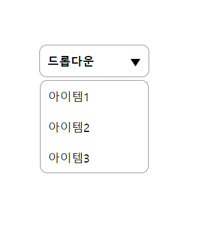
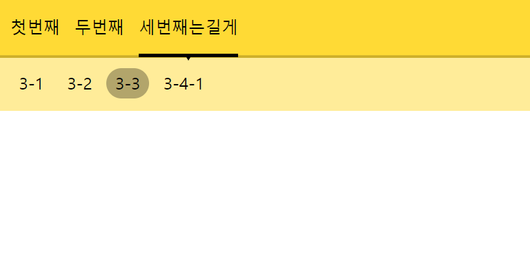
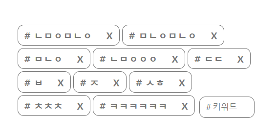

# 내가 직접 만드는 FrontEnd lib 🐣

> 본 repository의 목적은 공부하고 만드는 것들을 저장해두기 위함입니다.

## Dropdown

선택한 item의 이름을 보여주는 가장 기본적인 DropDown

## DropDown-nav

Global Nav인데 Sub-Nav까지 아래에 표시가 되고 hover시 약간의 효과를 추가했다.

## Slide

좌 우 클릭하면 넘어가는 슬라이드로 아래 indicator및 화살표까지 구현(전환 효과는 이동이 아니라 나타내기)

## Star-Score

리뷰기능에 흔히 들어가는 별점으로 image바꿔서 사용가능, 드래그 및 클릭 그리고 모바일에서의 touch까지 구현

## Tag-maker

해시태그 입력할수 있는 Form

- 이미 존재하는 tag생성 방지
- 백스페이스로 삭제하기
- 클릭으로 삭제하기
- 엔터로 작성
- 스페이스로 작성

### ETC

- WebStorage 연습
